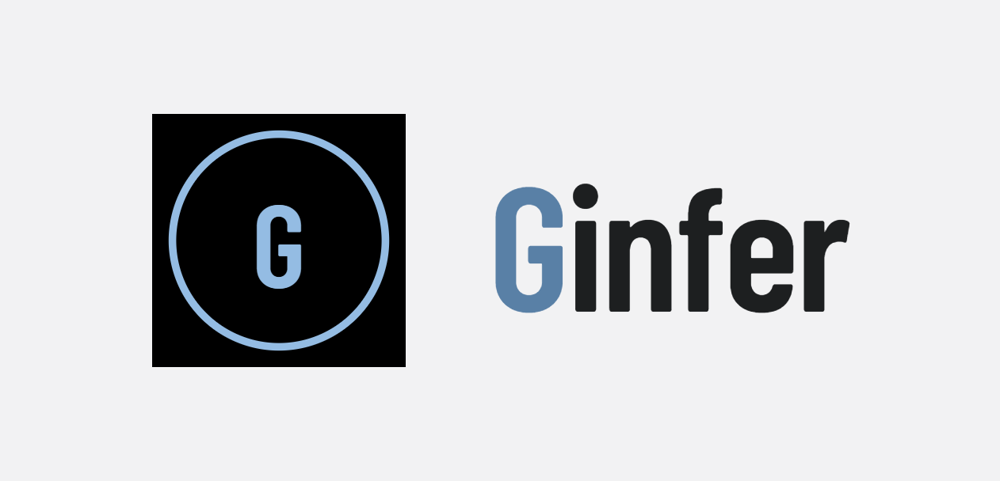
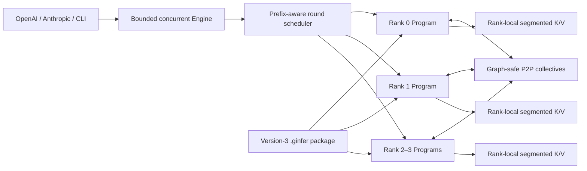
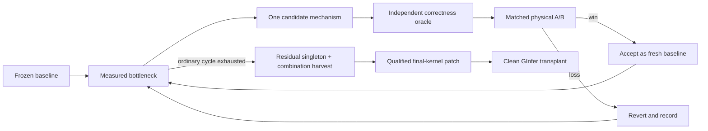

# GInfer

<p align="center">
  <picture>
    <source media="(prefers-color-scheme: dark)" srcset="icons/ginfer-lockup-reversed.png">
    <source media="(prefers-color-scheme: light)" srcset="icons/ginfer-lockup.png">
    
  </picture>
</p>

<p align="center">
  <strong>Production-class C++/CUDA serving for long-context agentic operations.</strong>
</p>

<p align="center">
  
  
  
  
  <a href="LICENSE"></a>
</p>

<p align="center">
  <a href="#quick-start">Quick start</a> ·
  <a href="#releases-and-containers">Releases</a> ·
  <a href="#gchat">GChat</a> ·
  <a href="docs/cli.md">CLI</a> ·
  <a href="docs/serving.md">Serving API</a> ·
  <a href="docs/performance.md">Performance</a>
</p>

---

GInfer is a focused inference engine for production-class agentic operations and development. It
is designed for higher-concurrency serving, long-lived conversations, large shared prefixes,
repeated tool turns, and substantially more pressure on K/V storage than a one-shot chat benchmark.

The project began as a fork of `Neroued/ninfer`. Since then, its runtime, target packages, artifact
contract, K/V architecture, multi-GPU execution, serving surface, and performance-critical kernels
have been extensively rewritten and optimized. GInfer remains intentionally narrow: it trades the
generality of a framework runtime for explicit model contracts and hardware-specific performance.

## At a glance

| | GInfer release scope |
| --- | --- |
| **Serving** | OpenAI Responses and Chat Completions, Anthropic Messages, streaming, CLI |
| **Workload** | Startup-fixed C1–C8 request concurrency, native long context, prefix-heavy agent sessions |
| **Models** | Qwen3.8-27B and Muse Glimmer 30B |
| **Execution** | Autoregressive or model-native DFlash2 speculative decoding; CUDA Graph replay |
| **Topology** | Independently optimized TP1, TP2, and TP4 packages |
| **GPU images** | Separate `sm_80`, `sm_86`, `sm_89`, and `sm_120a` builds as each profile permits |
| **Artifact** | Producer-final version-3 `.ginfer` package; no runtime quantization, splitting, or repacking |
| **Context** | 262,144 tokens for Qwen3.8; 131,072 tokens for Muse Glimmer |

## Engine architecture



### Segmented-cascade K/V

The K/V subsystem is built for long-running, prefix-heavy work rather than a fixed per-request
slab. Each TP rank owns one unified physical arena containing immutable shared-prefix segments,
private mutable tails, sliding state, and speculative state. Capacity grows elastically, inactive
prefixes can be evicted under pressure, and active Attention never reads remote K/V over PCIe.

- Prefix identity includes the model, artifact, codec, positions, media, and runtime semantics.
- DFlash2 writes provisional K/V and commits only the accepted frontier.
- CUDA Graphs consume stable indirect descriptors instead of capturing one graph per prefix.
- BF16, INT8-G64, and Blackwell-native NVFP4-G16 K/V routes are explicit, profile-bound choices.
- Native compressed K/V uses target- and TP-aware calibration for each rank-local K/V head and
  storage plane; calibration identity is bound into the artifact contract.
- There is no hot-path allocation and no decode-time host or peer K/V fallback.

### Model × SM kernel system

GInfer does not ask one generic kernel path to cover every GPU and model. Every supported compute
capability receives a separate build image, and each registered model/storage profile selects a
closed portfolio of kernels tuned for its real shapes. Current images cover GA100 (`sm_80`),
Ampere (`sm_86`), Ada (`sm_89`), and Blackwell (`sm_120a`) where the numeric format is legal and
physically qualified.

The engine includes target-specific fused and quantized linear paths, Gated DeltaNet kernels,
segmented and shared-prefix Attention, native K/V codecs, distributed sampling and DFlash2
selection, and graph-safe collectives. Launch geometry is derived from the live GPU rather than a
hard-coded SM count.

### Version-3 artifacts

A `.ginfer` v3 file is a complete deployment package, not a runtime conversion recipe. Its closed
directory identifies the exact model, weight profile, target TP degree, optional DFlash body degree,
final rank placement, tensor formats, layouts, and required frontend resources.

TP1, TP2, and TP4 packages are produced and verified offline. At startup GInfer validates the
selected package and uploads its final rank payloads directly—no weight reconstruction, slicing,
quantization, repacking, or filename guessing occurs in the serving engine.

### TP1, TP2, and TP4

Tensor parallelism is startup-fixed and deliberately explicit. Each rank owns a persistent host
thread, CUDA context, model Program, K/V arena, recurrent state, workspace, and CUDA Graph family.
Ranks execute concurrently and synchronize only at high-level prefill, decode, resolve, and commit
boundaries. Startup verifies a homogeneous group, UVA, complete directed peer access, and real peer
copies before loading weights.

DFlash2 placement may be smaller than target-model TP when the artifact declares it—for example,
a TP4 target can carry a DFlash body on one or two ranks while keeping vocabulary projection,
selection, verification, and acceptance distributed. The placement is chosen when the model is
built and selected at startup; it is never reconstructed on load.

## Model packages

| Model | Native context | Modalities | Release package families |
| --- | ---: | --- | --- |
| **Qwen3.8-27B** | 262,144 | Text, image, video | AutoRound/groupwise and NVFP4 backbones; autoregressive or Qwen-specific DFlash2 |
| **Muse Glimmer 30B** | 131,072 | Text, image, video | AutoRound/groupwise and NVFP4 backbones; autoregressive or Muse-specific DFlash2 |

Release artifacts are newly composed from frozen sources and pinned recipes rather than renamed
legacy files. Public Qwen packages are freshly quantized from the selected official BF16 source
with a frozen calibration corpus. Muse AutoRound is freshly calibrated from its selected BF16
source; the verified Red Hat NVFP4 codes, block scales, and global multipliers are preserved by
design instead of being silently requantized.

Three parts of the release are treated independently:

- **Fresh backbone quantization.** Release packages are rebuilt and recalibrated from frozen,
  versioned inputs; already-native quantized source words are preserved only when that is the
  selected numerical contract.
- **Recalibrated K/V.** K/V calibration is separate from backbone quantization. Every model and TP
  layout gets a newly bound, target-specific profile with rank-local head/plane normalization.
- **Model-specific DFlash2.** DFlash2 companions are freshly quantized and calibrated for their own
  model release—Qwen and Muse never share one. Q4, mixed Q4/W8, and W8 matrix allocations are
  evaluated as distinct package identities.

Only the strongest configuration that passes numerical, acceptance, memory, long-context, and
whole-Engine qualification becomes a release profile.

<details>
<summary><strong>Registered runtime identities</strong></summary>

**Qwen3.8-27B**

- `groupwise-int-dflash2-q4`
- `groupwise-int-dflash2-q4w8`
- `groupwise-int-dflash2-w8`
- `nvfp4`
- `nvfp4-dflash2-q4`
- `nvfp4-dflash2-q4w8`
- `nvfp4-dflash2-w8`

**Muse Glimmer 30B**

- `groupwise-int`
- `groupwise-int-dflash-q4`
- `groupwise-int-dflash-q4w8`
- `groupwise-int-dflash-w8`
- `nvfp4`
- `nvfp4-dflash-q4w8`
- `nvfp4-dflash-w8`

Registration means the reader, binder, and execution route are exact. It does not by itself mean
that every identity is qualified on every GPU image; consult [Performance](docs/performance.md) for
the current physical qualification matrix.

</details>

## How kernels are optimized

GInfer's production kernels are selected by the separate **Kernel Agent** campaign system. Each
campaign freezes one model, artifact profile, GPU/SM image, TP degree, concurrency/context matrix,
correctness oracle, and accepted baseline.



An ordinary cycle explores up to 24 isolated candidates and stops at the first fully qualified win.
After a complete no-win cycle, smaller positive candidates are requalified—alone and, when their
mechanisms are compatible, in combination—against the current baseline. A smaller gain is accepted
only when repeated matched measurements show that it is real and all correctness gates still pass.

Candidate history, run logs, profiler output, and build products stay outside this repository. Only
the final replay-verified source delta, durable tests, repository-native benchmarks, and concise
qualification result are transplanted into GInfer.

## Quick start

### Build

```bash
git clone https://github.com/Gadflyii/ginfer.git
cd ginfer

cmake -S . -B build -G Ninja -DCMAKE_BUILD_TYPE=Release
cmake --build build -j
```

The default build targets Blackwell `sm_120a`. Select another supported image explicitly with
`-DCMAKE_CUDA_ARCHITECTURES=80`, `86`, or `89`. Numeric formats and physical qualification still
depend on the chosen model profile and GPU.

### Run the CLI

```bash
./build/apps/ginfer models/qwen38_27b_nvfp4_dflash2.ginfer \
  --tp 1 --max-context 262144 --spec auto \
  --prompt "Design a fault-tolerant tool-calling workflow."
```

For an exact TP2 package:

```bash
CUDA_VISIBLE_DEVICES=0,1 \
./build/apps/ginfer models/qwen38_27b_nvfp4_dflash2_TP2.ginfer \
  --tp 2 --max-context 262144 --spec auto
```

Use `--spec none` for autoregressive execution. Qwen Vision currently requires that mode; Muse
Vision may run with DFlash2.

### Start the server

```bash
CUDA_VISIBLE_DEVICES=0,1 \
./build/apps/ginfer-serve models/qwen38_27b_nvfp4_dflash2_TP2.ginfer \
  --tp 2 --host 0.0.0.0 --port 8011 \
  --max-context 262144 --max-concurrency 8 --spec auto
```

```bash
curl http://127.0.0.1:8011/v1/responses \
  -H 'content-type: application/json' \
  -d '{"model":"qwen3.8-27b","input":"Explain segmented K/V caching."}'
```

An optional `ginfer-artifact-set-v1` descriptor can declare independent TP1/TP2/TP4 packages and
allow startup to select the largest healthy declared topology. Use `--tp-fallback reject` when the
requested degree must be exact.

## Releases and containers

The first version-3 distribution is being prepared as a matched set of native and containerized
release assets:

| Channel | Release deliverable |
| --- | --- |
| **Linux** | Native x86-64 builds of <code>ginfer</code> and <code>ginfer-serve</code> |
| **Windows** | Native Windows 10/11 x64 builds with the same Engine, CLI, and serving surface |
| **Docker for Linux** | Pre-built NVIDIA Container Toolkit images, tagged by GInfer release and SM family |
| **Docker for Windows** | Pre-built Docker Desktop/WSL2 images with NVIDIA GPU pass-through |

Release images remain architecture-specific rather than fat binaries. Model packages are
distributed separately so an engine or container can be updated without duplicating multi-gigabyte
weights.

> [!NOTE]
> Binary, container-registry, and installer links will appear with the first v3 release. Until then,
> this README describes the frozen release target; the source build above remains the developer
> entry point.

## GChat

**GChat is an all-in-one Windows client for GInfer, currently in development.** Its repository link
will be added here when the project is published.

GChat is designed to bundle the complete local-agent experience:

- the GInfer engine and local OpenAI-compatible server, managed automatically;
- a native desktop chat interface with first-class tool calling;
- an agentic harness with a visual loop builder and work dispatcher;
- an integrated CLI coding harness for terminal-first development;
- a curated model download manager with install, progress, pause/resume, and local model lifecycle;
- one installer and one launch path—install it, select a model, and run.

The application remains local-first: GInfer performs inference on the user's NVIDIA GPU, while the
desktop client owns model discovery, server lifecycle, conversations, tools, and agent workflows.

## Deliberate boundaries

GInfer is a serving engine, not a checkpoint workshop or universal graph runtime. Quantization,
calibration, conversion, TP partitioning, artifact publication, training data, and campaign
orchestration live in separate private repositories. The public release contains the runtime,
supported model contracts, durable tests, user-facing benchmarks, and clean release history only.

## Documentation

- [CLI reference](docs/cli.md)
- [OpenAI and Anthropic serving](docs/serving.md)
- [Performance methodology and qualification](docs/performance.md)
- [Documentation index](docs/README.md)

## License

GInfer is available under the [Apache License 2.0](LICENSE).

## Upstream acknowledgement

GInfer began as a fork of **[Neroued/ninfer](https://github.com/Neroued/ninfer)**. We gratefully
acknowledge the original project and its authors as the foundation from which GInfer began.
